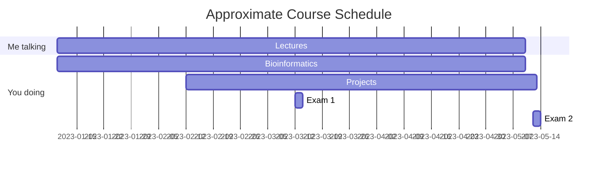

Molecular Evolution "Lab" - Getting Started 
===

## Table of Contents

[TOC]

## Acknowledgments
Most of the material in this course was modeled after publicly available resources from the Woods Hole course in Molecular Evolution. Contributors to that course are deeply appreciated!

## Getting set up on LONI

If you do not yet have a LONI (our HPC - Louisiana Optical Network Infrastructure) account, start here!

1. Visit https://allocations.loni.org/ to sign up for an account
2. Learn about our computing resources here http://www.hpc.lsu.edu/index.php
3. If you are new to Unix, please watch the "Introduction to Linux" video here http://www.hpc.lsu.edu/training/archive/tutorials.php
4. If you are new to remote computing environments, please watch the two "HPC User Environment" recordings here http://www.hpc.lsu.edu/training/archive/tutorials.php

Once you have a LONI account and have familiarized yourself with its directory structure and how to appropriately use shared files and directories, please email me your username so that I can add you to our class's project directory.


## Joining the Slack Workspace

Slack is a messaging/discussion platform that allows for groups to interact. I've set up a Slack workspace for our class to facilitate questions and discussions. You can use Slack on your laptop and phone. Please email me at Cassin.Sackett@gmail.com with your preferred email to use for Slack.

The Slack workspace is called Molecular Evolution UL 2023.

You can silence notifications outside of your preferred working hours.

## Required Software

Windows:
-[Cyberduck](https://cyberduck.ch/) or [Filezilla](https://filezilla-project.org/) (for file transfer via sFTP)
-[Git for Windows](https://gitforwindows.org/) (a Unix emulator for running command-line programs)
-[Notepad](https://notepad-plus-plus.org/downloads/v8.4.7/) (Important - After you have installed it, open and go to Settings, Preferences, New Document, and set the line endings to Unix)
-[Seaview](https://doua.prabi.fr/software/seaview) (used to visualize small alignments)
-[FigTree](https://github.com/rambaut/figtree/releases) (used to visualize phylogenetic trees)
-[Tracer](https://github.com/beast-dev/tracer/releases/) (used for Bayesian divergence time analyses)
-[MEGA](https://megasoftware.net/) (used to visualize small alignments and generate prior trees)

MacOS:
-[Cyberduck](https://cyberduck.ch/) or [Filezilla](https://filezilla-project.org/) (for file transfer via sFTP)
-[BBEdit](https://www.barebones.com/products/bbedit/) (for fast text manipulation)
-[Seaview](https://doua.prabi.fr/software/seaview) (used to visualize small alignments)
-[FigTree](https://github.com/rambaut/figtree/releases) (used to visualize phylogenetic trees)
-[Tracer](https://github.com/beast-dev/tracer/releases/) (used for Bayesian divergence time analyses)
-[MEGA](https://megasoftware.net/) (used to visualize small alignments and generate prior trees)

We will use additional software throughout the course that will be available, primarily via conda environments, on LONI. 


## SSH for newbies (via Woods Hole authors)
SSH stands for Secure SHell. Shells are computer programs that represent the outermost layer of the operating system, allowing you to interact with the OS via commands. Another name for a shell is command interpreter. SSH is secure because every bit of text that moves between your keyboard and the operating system is encrypted.

**SSH on Mac OS**

* Open a Terminal window (in /Applications/Utilities)
* Log in to LONI using your username: ssh -X username@qbc.loni.org and supply your password when prompted
 
**SSH on Windows**

* Use Git for Windows to access LONI (Start menu - All Programs - Git BASH)
* Log in to LONI using your username: ssh -X username@qbc.loni.org and supply your password when prompted

## Basic Unix Syntax
Unix commands follow the general format of
```
command -options target
```
although not all commands need options or targets.

>  See Slack for more tips and tricks. :sunflower:


Course and Project Timeline
---



## Appendix and FAQ

:::info
**Find this document incomplete?** Leave a comment!
:::

###### tags: `Courses` `Documentation`
